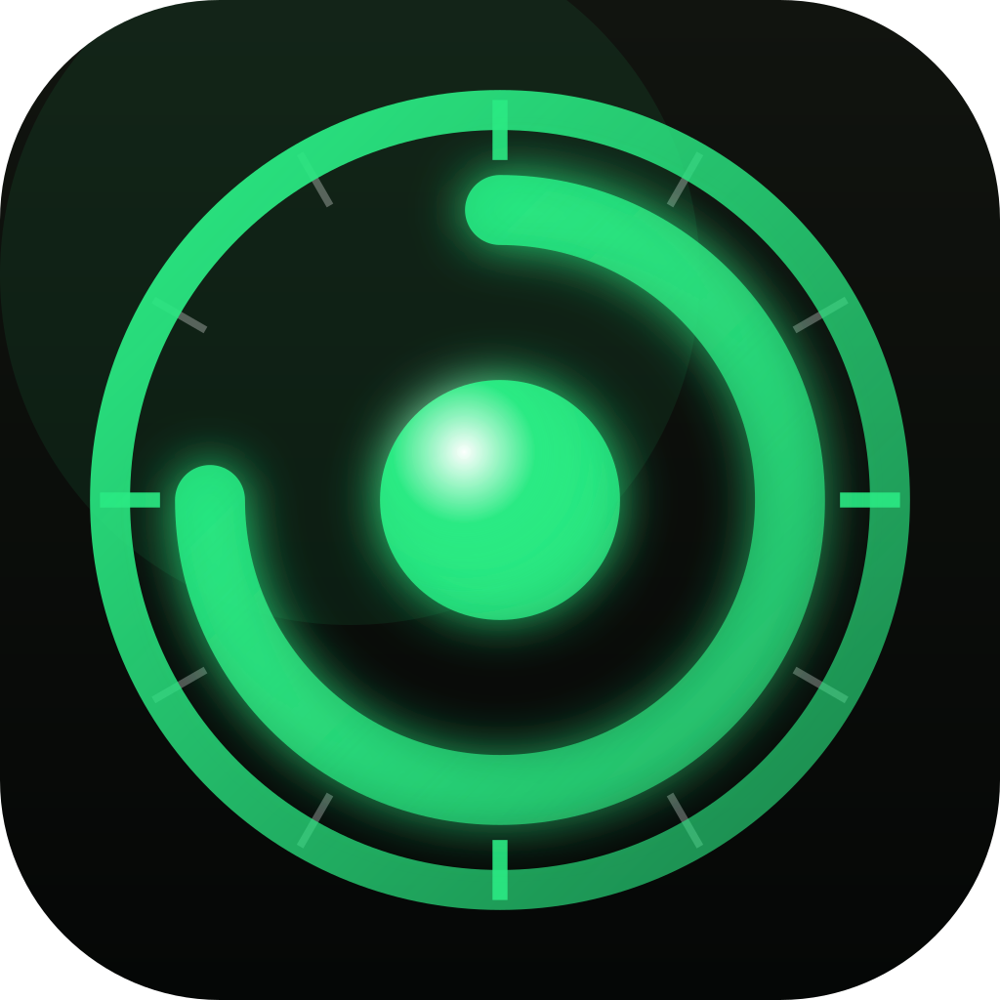

# OpenRize

**A real answer to "where did my day go?" - automatic, private, local-first time tracking for your Mac. Free, open-source, no account, no screenshots, no keystrokes.**

[](#where-it-stands)
[](LICENSE)
[](https://tauri.app)
[](https://www.rust-lang.org)

<div align="center">

</div>

OpenRize is the open, local-first answer to [Rize.io](https://rize.io): time tracking that
watches what you're actually working on and sorts it into categories and projects - without
logging a single keystroke, taking a single screenshot, or shipping a byte of your data anywhere.
The categorizing is done by AI that runs entirely on your Mac and learns from every entry you review.

---

## ⚠️ Alpha - read this first

The core product works end to end: OpenRize captures your activity in the background, folds it
into reviewable time entries, suggests a category and project for each one with an on-device model,
and learns from what you accept and correct. You can review your day on a calendar, approve a whole
timesheet, slice your time in reports, and manage projects and clients.

It is still alpha. There are no packaged releases and it only runs on macOS for now.

## Where it stands

**Platforms** - built and tested on macOS. Tauri itself compiles for all three, but window capture
uses the macOS Accessibility API and the AI runs in a macOS-only Swift sidecar, so nothing outside
macOS has been verified.

| Platform | Supported |
| --- | --- |
| 🍎 macOS (Apple Silicon) | ✅ Built and tested |
| 🍎 macOS (Intel) | 🔶 Untested - no Foundation Model on Intel, so AI would run rules + personal model only |
| 🪟 Windows | ❌ Untested - capture and the AI sidecar are macOS-specific |
| 🐧 Linux | ❌ Untested - capture and the AI sidecar are macOS-specific |

The full AI tier needs macOS 26+ with Apple Intelligence turned on. Without it, OpenRize falls back
to your rules and a personal model it trains on your own reviews and keeps categorizing.

## Features

| Area | Status | What it is |
| --- | --- | --- |
| **Calendar** (Day, Week, Month) | ✅ Working | The landing page. Day is a timeline of entry blocks with a docked review panel. Week shows seven columns with per-day totals and pending counts. Month shows each day's hours, a category bar, and an "N to review" badge. |
| **My Timesheet** | ✅ Working | Day, week, or month of entries to review: stat cards against your weekly target, tabs for To review / Processing / Approved / All, grouping and filters, inline edits, and bulk approve. |
| **Timers** | ✅ Working | Manual stopwatches: any number of named timers, running concurrently, that keep going across views and restarts. |
| **Apps** | ✅ Working | Every detected app, with its category and project mapping and an exclusion toggle. |
| **Time Entries** | ✅ Working | Any range with filters and full-text search over descriptions and window titles. A pivot table, charts by project, category, and app, a sortable log, saved views, and CSV or JSON export. |
| **Timesheets** | 🚧 Placeholder | Projects x days grid. |
| **Projects** (with Clients) | ✅ Working | Active, Completed, Archived, and Clients tabs. Budgets, due dates, a per-project detail page, AI hints that become rules, and project discovery from repo paths, forge URLs, and editor titles. CSV import. |
| **Invoices** | 🚧 Placeholder | Draft, sent, and paid invoices per client from approved billable project time. |
| **Settings** | ✅ Working | Theme and accent, menu bar and close behavior, storage location, activity retention, expected hours per week, and Categories & AI (engine status, auto-accept threshold, custom instructions, AI effectiveness, personal model versions, Retrain now, Reset learned data). |
| **Automatic capture** | ✅ Working | A background sampler records the foreground app, its window title (via Accessibility, not Screen Recording), and the URL in Safari and Chromium browsers. Idle and sleep time are not counted as work. |
| **AI categorization & review** | ✅ Working | Each entry gets a category and project suggestion with a confidence meter, a "Why" line, and pickable alternatives. Keyboard review mode, and auto-approve only when both fields clear your threshold. |
| **Learning loop & calibration** | ✅ Working | Your accepts and corrections feed the personal model, offer a rule after 3 consistent corrections, trigger background retraining, and calibrate the confidence you see against how often you actually agree. |
| **Menu-bar tray** | ✅ Working | A menu-bar glyph. Closing the window can hide OpenRize there so capture keeps running. |
| **Sync server** | ❌ Not started | If there is demand, a self-hostable server for syncing between machines and organization level features. |

## Local-first

- **No account.** There is nothing to sign up for and nobody to sign up with.
- **No telemetry.** OpenRize makes no network calls. Not "anonymized" - none.
- **On-device AI.** Categorization runs on your Mac through Apple's Foundation Models,
  NaturalLanguage, and Create ML. Your activity never leaves the machine to be classified.
- **No keystroke logging, no screenshots, no screen recording.** Tracking is metadata about
  *what app you're in*, not a recording of what you typed.
- **No surveillance posture.** OpenRize is a personal/agency tool for billing your own honest hours,
  not a way to watch employees.

## Under the hood

OpenRize is a Tauri 2 app: a Rust core with a React webview as its view, plus a small Swift
sidecar for the on-device ML.

Everything durable lives in SQLite behind the Rust core, with versioned migrations. React holds only the current route, transient UI state, and
the last snapshot Rust sent it; Rust pushes events when something changes.

```text
┌──────────────────────────────────────────────────────────────────┐
│  Rust core (src-tauri)          owns all durable state (SQLite)  │
│                                                                  │
│  capture ── foreground app, AX window title, browser URL,        │
│    │        idle and sleep detection  ->  segments               │
│    ▼                                                             │
│  entry builder ── folds segments into reviewable time entries    │
│    │                                                             │
│    ▼                                                             │
│  classification worker ── drains the classify_jobs queue         │
│    │   T0  rules ............ a hit is 100% confident            │
│    │   T1  personal ......... kNN over embeddings + Create ML    │
│    │   T2  Foundation Model . category, project, description     │
│    ▼                                                             │
│  arbiter ── blends the tiers, calibrates confidence, pre-fills   │
│    │        or auto-approves                                     │
│    ▼                                                             │
│  learning loop ── verdicts -> kNN, rule offers, gated retrain,   │
│                   isotonic calibration                           │
│                                                                  │
│  also: projects, reports and export, timers, settings, tray      │
│                                                                  │
│  IPC commands + pushed events ─────────────────────────────┐     │
└────────┬───────────────────────────────────────────────────┼─────┘
         │ JSON lines over stdio                             │
┌────────▼───────────────────────────────┐                   │
│  Swift sidecar (src-tauri/swift)       │                   │
│   Foundation Models ── T2 suggestion   │                   │
│   NLEmbedding ──────── embeddings      │                   │
│   Create ML ────────── personal model  │                   │
└────────────────────────────────────────┘                   │
┌────────────────────────────────────────────────────────────▼─────┐
│  React view (src)                                                │
│   typed Route union + back/forward history, no router dependency │
│   pages/ ── Calendar, My Timesheet, Timers, Apps, Time Entries,  │
│             Timesheets, Projects, Invoices, Settings             │
│   useTauriEvent ── the one way to subscribe to Rust events       │
└──────────────────────────────────────────────────────────────────┘
```

- **Capture** samples the foreground window in the background and folds consecutive samples into
  segments. It closes out on idle and on sleep or lid-close, and holds an App Nap assertion so
  sampling stays precise while the window is hidden.
- **The entry builder** turns segments into time entries, the unit you review: it absorbs
  micro-switches, closes on idle, breaks, and midnight, aims for about 30-minute entries, and never
  touches an entry you have approved.
- **The classification worker** extracts features (app and bundle id, window titles, domains,
  duration, time of day, previous entry) and runs three tiers. **T0** is your rules, including the
  ones generated from project AI hints. **T1** is personal: nearest neighbours over sentence
  embeddings of your approved entries, plus a Create ML text classifier trained on them. **T2** is
  Apple's on-device Foundation Model, constrained to your live category and project lists; it also
  writes the entry's short description, and it is re-sampled when it disagrees with T1.
- **The arbiter** blends the tiers, leaning toward the personal signals as you label more. Confidence
  is capped at 90% until there are 50 outcomes; after that an isotonic calibration curve fit on your
  own verdicts replaces the cap. Suggestions pre-fill at 60% and auto-approve only when both category
  and project clear your threshold (95% by default) and you have not touched the entry.
- **The learning loop** retrains after 20+ new labels or nightly, but only while the Mac is idle, on
  AC power, and not in Low Power Mode. A new model is checked on a holdout set and swapped in only if
  it is not worse, and every attempt is versioned.
- **The Swift sidecar** is a separate binary shipped as a Tauri `externalBin` and spoken to over JSON
  lines on stdio. Foundation Models is weak-linked, so the same binary runs without Apple
  Intelligence and reports that it is in fallback.

Stack: [Tauri 2](https://tauri.app) · Rust · SQLite · Swift · [React 19](https://react.dev) · TypeScript · [Tailwind CSS 4](https://tailwindcss.com) · [Vite](https://vite.dev)

## Building from source

There are no packaged releases yet, so building from source is the only way in. First install the
[Tauri prerequisites](https://tauri.app/start/prerequisites/) (on macOS: Xcode command line tools
and Rust), plus Node and pnpm. The Rust build also compiles the Swift sidecar with `swift build`, so
it needs the **Xcode 26+** command line tools.

```sh
git clone git@github.com:Kareeme246/OpenRize.git
cd OpenRize
pnpm install
pnpm tauri dev          # run it
pnpm tauri build        # produce a release bundle
```

On first run, grant OpenRize **Accessibility** permission in System Settings so it can read window
titles.

## Contributing

Contributions are welcome - issues, focused PRs, or opinions about the roadmap.

Before you start, a few things in this repo will save you time:

- **[`AGENTS.md`](AGENTS.md)** - project conventions. Notably: always agree on whether a feature
  lives in `src-tauri`, `src`, or both *before* writing code, ground Tauri work in the
  [Tauri docs](https://docs.rs/tauri/2.11.5/tauri), and run `pnpm fix` then `pnpm verify` before
  calling a change done. It also explains `pnpm dev:screenshot` and `pnpm dev:drive` for seeing a
  change in an isolated instance of the real app.

**Roadmap.** OpenRize is being built in phases:

| Phase | Scope | Status |
| --- | --- | --- |
| P0 | Foundations: migrations, typed routes, the new sidebar, Accessibility titles, URL capture, sleep handling | ✅ Done |
| P1 | Categories, projects and clients, the entry builder, time entries, Calendar Day with manual assignment | ✅ Done |
| P2 | On-device AI: the Swift sidecar, the tiers and arbiter, suggestion UI, review mode, auto-accept | ✅ Done |
| P3 | Calendar Week and Month, My Timesheet, Time Entries, the Projects page | ✅ Done |
| P4 | The learning loop and confidence calibration | ✅ Done |
| P5 | Timesheets and Invoices | Next |
| Future | A self-hostable sync server | Future |

## License

**GNU Affero General Public License v3.0** - see [LICENSE](LICENSE).

AGPL-3.0 is deliberately strong copyleft: if you run a modified OpenRize as a network service, you
must offer its source to the people using it. Derivatives stay open, which is the point - the
tracking engine should never become something you can't audit.

---

Built on [Tauri](https://tauri.app), [React](https://react.dev), and [Tailwind CSS](https://tailwindcss.com).
